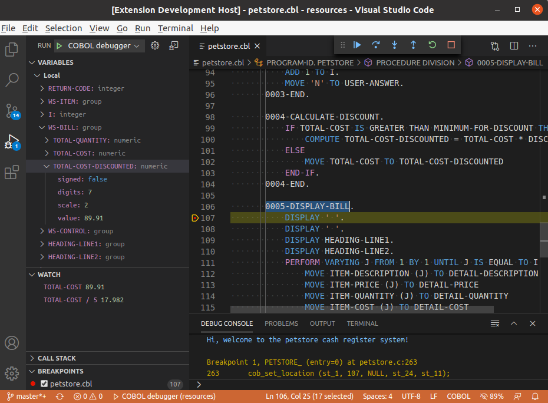
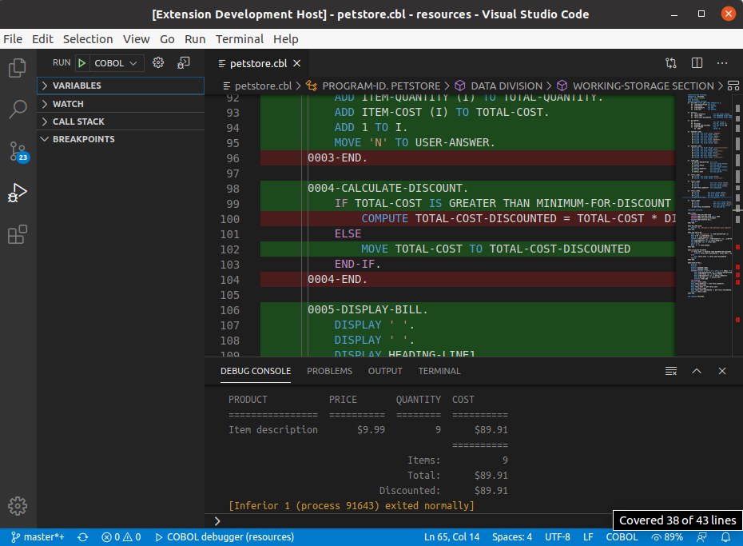

<h1 align="center">
  <br>
    
  <br>
  VS Code Debugger for GnuCOBOL
  <br>
  <br>
</h1>

<h4 align="center">Debug COBOL code from VS Code.</h4>

<p align="center">
  <a href="https://marketplace.visualstudio.com/items?itemName=OlegKunitsyn.gnucobol-debug"></a>
  <a href="https://marketplace.visualstudio.com/items?itemName=OlegKunitsyn.gnucobol-debug"></a>
  <a href="https://marketplace.visualstudio.com/items?itemName=OlegKunitsyn.gnucobol-debug"></a>
</p>

A VS Code extension to debug or execute GnuCOBOL code. [Install from VS Code Marketplace](https://marketplace.visualstudio.com/items?itemName=OlegKunitsyn.gnucobol-debug).

### Features
* Setting breakpoints
* Continue, Stop, Restart, Step Over, Step Into, Step Out
* Variables pane
* Code coverage
* No mainframe required



### Requirements
* GnuCOBOL `cobc` 2.2+ installed.
* GNU Debugger `gdb` 6.0+ installed.
* A COBOL-syntax extension i.e. `ibm.zopeneditor`, `broadcommfd.cobol-language-support`, `rechinformatica.rech-editor-cobol` or `bitlang.cobol` installed. Otherwise, the breakpoints will be unavailable.

### Usage
When your `launch.json` config is set up, you can debug or execute your COBOL program. If you debug a Compilation Group (main- and sub- programs), you need to list sub-programs inside `group` property. Here's an example:
```json
{
    "version": "0.2.0",
    "configurations": [
        {
            "name": "COBOL debugger",
            "type": "gdb",
            "request": "launch",
            "target": "${file}",
            "targetargs": [],
            "cwd": "${workspaceRoot}",
            "gdbpath": "gdb",
            "cobcpath": "cobc",
            "cobcargs": ["-free", "-x"],
            "group": ["subsample.cbl", "subsubsample.cbl"],
            "coverage": false
        }
    ]
}
```

Pick `COBOL debugger` from the dropdown on the Debug pane in VS Code. Press the Play button or `F5` to debug or `Ctrl+F5` to execute.

The debugger uses C sourcecode generated by the compiler upon each debugging session. If the sourcemap isn't accurate or you see any other issues, please make a bug-report.

### Code coverage
You can estimate an execution flow of your COBOL program. 



Set `coverage` property to `true` in your `launch.json` and start debugiing session. Here's an example:
```json
{
    "version": "0.2.0",
    "configurations": [
        {
            "name": "COBOL debugger",
            "type": "gdb",
            "request": "launch",
            "target": "${file}",
            "targetargs": [],
            "cwd": "${workspaceRoot}",
            "gdbpath": "gdb",
            "cobcpath": "cobc",
            "cobcargs": ["-free", "-x"],
            "group": [],
            "coverage": true
        }
    ]
}
```

The extension decodes the code-coverage files in `gcov` format generated by the compiler.

### Roadmap
- Mac
- Windows

Your contribution is always welcome!

### Troubleshooting
Add `verbose` property to your `launch.json` and start debugiing session. In `DEBUG CONSOLE` you will see complete communication log between `gdb` and VS Code. Here's an example:
```json
{
    "version": "0.2.0",
    "configurations": [
        {
            "name": "COBOL debugger",
            "type": "gdb",
            "request": "launch",
            "target": "${file}",
            "targetargs": [],
            "cwd": "${workspaceRoot}",
            "gdbpath": "gdb",
            "cobcpath": "cobc",
            "cobcargs": ["-free", "-x"],
            "group": [],
            "coverage": false,
            "verbose": true
        }
    ]
}
```

